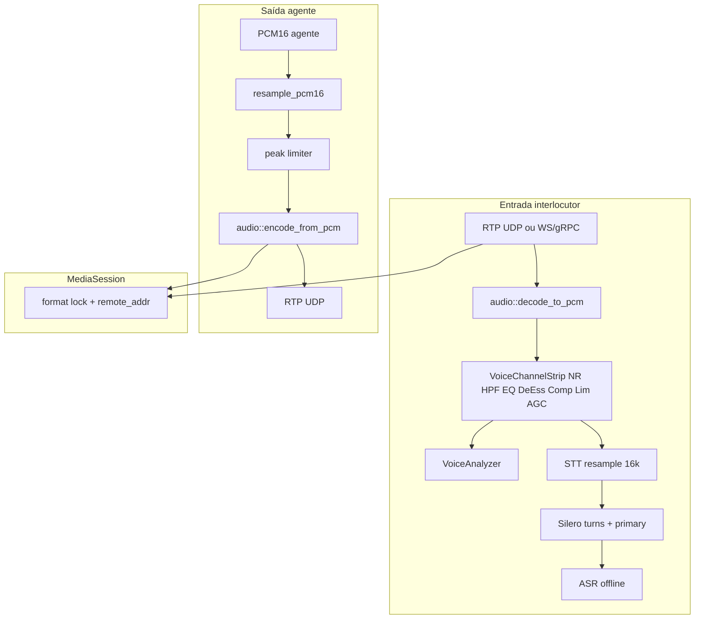
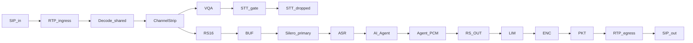

# Audio pipeline — voiceqas

## Objetivo

Processar áudio de tronco SIP com pipeline **assimétrico**:

- **Interlocutor:** decode → PCM16 normalizado → VQA/STT (permanece PCM internamente)
- **Agente de voz:** PCM TTS → encode no codec negociado → RTP/UDP ao trunk

O problema alvo é qualidade da **voz do interlocutor** (nível baixo, ruído), não defeitos de rede SIP.

## Diagrama



## Formatos suportados

| Formato | PCM rate | RTP PT | Encode outbound |
|---------|----------|--------|-----------------|
| `rtp_pcmu` | 8 kHz | 0 | Sim |
| `rtp_pcma` | 8 kHz | 8 | Sim |
| `rtp_g722` | 16 kHz | 9 | Sim |
| `rtp_g729` | 8 kHz | 18 | Sim |
| `pcm_s16le_8k` | 8 kHz | — | Raw PCM |
| `pcm_s16le_16k` | 16 kHz | — | Raw PCM |

Identificação de entrada:

1. **Declarativa** — `POST /v1/media/sessions` (default `rtp_g722`), handshake WS/gRPC, header `X-Audio-Format`
2. **Autodetect RTP** — PT do header (`0→PCMU`, `8→PCMA`, `9→G722`, `18→G729`); preferido **G.722**
3. **UDP sem sessão prévia** — PT inferido do primeiro pacote; alerta ops se ≠ `rtp_g722`

**Format lock:** após a primeira frame válida, o codec da sessão não pode mudar. Nova negociação exige novo `session_id`.

## Processamento inbound

### Decode

Módulo unificado: `audio::decode_to_pcm()` em [`src/audio/decoder.cpp`](../../src/audio/decoder.cpp).

- RTP: `RtpDepacketizer` com estado (loss, jitter, G.722/G.729 stateful)
- PCM: cópia direta int16 LE

#### Channel strip (`audio.strip`)

Defaults calibrated (S15, Jul/2026): **NR off**, DeEss off, mild EQ, soft compressor (ratio 2 / makeup 0). Full RNNoise wet=1.0 regresses Whisper (latissima/suporte).

Ordem fixa em [`VoiceChannelStrip`](../../include/voiceqas/audio/dsp/channel_strip.hpp):

**NR → HPF → EQ → De-esser → Compressor → Limiter → AGC**

| Estágio | Default | Knobs principais |
|---------|---------|------------------|
| NR (RNNoise) | **off** | `wet_dry` (0–1) |
| HPF | on | `cutoff_hz` 80 |
| EQ | on (mild) | 4 peaking (-1.5@250, -1@450, +1@2500, +1@3500) |
| De-esser | **off** | 6.5 kHz, thr −25, ratio 3:1 |
| Compressor | on (soft) | thr -20, ratio 2:1, makeup 0 |
| Limiter | on | ceiling **−1 dBFS** |
| AGC | on | target **−18 dBFS RMS**, max 24 dB |

Aliases legados: `normalize_enabled` ↔ `strip.agc.enabled`; `enhancement.enabled` ↔ `strip.nr.enabled`.

- Estado **por sessão** no media ingress / VQA; efêmero em `prepare_audio_for_stt` / batch
- Analysis Lab envia knobs via header `X-Audio-Strip` (JSON)
- RNNoise: resample → 48 kHz; requer `VOICEQAS_HAS_RNNOISE`; sem lib = no-op
- Env: `VOICEQAS_AUDIO_NORMALIZE=0`, `VOICEQAS_AUDIO_ENHANCEMENT=0`
- Egress do agente: só peak limiter (sem strip completa)

### Fork VQA / STT

- **VQA:** `VoiceAnalyzer` na taxa nativa do codec (8 ou 16 kHz); score = `speech_quality_score` (sem penalidade de silêncio); presença via `max_silence_ratio_for_ready` (default 0.40)
- **STT:** resample 16 kHz → Silero turnos + `diarization.focus_primary` → sherpa-onnx

### Ingress unificado (media relay)

`RtpIngressProcessor` mantém `RtpDepacketizer` + `VoiceChannelStrip` por sessão: decode uma vez, strip compartilhada, depois fan-out do **mesmo** PCM:

| Destino | API | Uso |
|---------|-----|-----|
| VQA | `VqaSessionManager::push_pcm(..., apply_agc=false)` | sem strip duplicada |
| STT | `SttSessionManager::append_pcm(..., shared_agc_ms, shared_enhancement_ms)` | telemetria NR/AGC |

Timer periódico no `media_relay` chama `emit_partials_for_all_sessions()`.

Caminhos REST/WS/gRPC chunk/batch usam `prepare_audio_for_stt` (strip + resample 16 kHz).

### Targets CMake

| Target | Conteúdo |
|--------|----------|
| `voiceqas_core` | Domínio: audio, RTP, VQA, STT, media — depende de `ports/` (interfaces), não de `ops/` |
| `voiceqas_ops` | Observability: metrics hub, pipeline tracker, Prometheus, webhooks, adapters |
| `voiceqas_server` | REST, WS, gRPC, media relay — compõe core + ops |

## Processamento outbound (agente)

1. PCM16 do TTS (tipicamente 16 kHz)
2. `resample_pcm16` → taxa da sessão (8 kHz G.711/G.729, 16 kHz G.722)
3. `apply_peak_limiter_inplace` (~−3 dBFS)
4. `encode_from_pcm` → G.711 / G.722 / G.729
5. `RtpPacketizer` → pacotes RTP 20 ms
6. `UDP sendto` → `remote_host:remote_port` da sessão

O interlocutor **nunca** passa por re-encode G.711.

## Media relay UDP

| Item | Valor |
|------|-------|
| Porta default | `10000/udp` |
| Env | `VOICEQAS_MEDIA_RTP_ADDR` |
| Config | `media.enabled`, `media.rtp_addr` |

Fluxo:

- **Inbound:** pacote RTP → `RtpIngressProcessor` (decode + channel strip) → fan-out PCM para `VqaSessionManager::push_pcm(apply_agc=false)` e `SttSessionManager::append_pcm`
- **Outbound:** `POST .../agent-audio` → encode → UDP

Integração SBC: voiceqas é **media plane only** (sem SIP INVITE/SDP). O SBC roteia RTP para `host:10000` e recebe RTP do agente no `remote_host:port` registrado.

## APIs REST

### Tools: process-audio (WAV tratado)

Único endpoint que **devolve áudio processado** (mono PCM16 WAV). Aplica `VoiceChannelStrip` na timeline completa (sem máscara Silero). Não dispara STT.

`POST /v1/tools/process-audio` — host Docker: `http://localhost:9080`

| Header | Uso |
|--------|-----|
| `Content-Type` | `audio/wav` ou `application/octet-stream` |
| `X-Audio-Format` | `pcm_s16le_16k`, `rtp_g722`, … (obrigatório se raw PCM) |
| `X-Sample-Rate` | ex. `16000` |
| `X-Audio-AGC` / `X-Audio-Enhancement` | `0`/`1` (aliases strip) |
| `X-Audio-Strip` | JSON `ChannelStripConfig` |
| `X-Session-Id` | opcional (telemetria) |

```bash
curl -sS -X POST "http://localhost:9080/v1/tools/process-audio" \
  -H "Content-Type: audio/wav" \
  -H "X-Audio-AGC: 1" \
  -H "X-Audio-Enhancement: 0" \
  --data-binary @input.wav \
  -o voiceqas-mix-strip.wav
```

**WS `/v1/stream` e gRPC `AnalyzeBatch` / `AnalyzeStream`** compartilham o mesmo strip no analyze path, mas respondem só com **métricas** (`QualityReport` / `BatchResponse`), não com PCM/WAV. Exemplos curl/ws/grpcurl: [`README.md`](../../README.md#audio-pipeline-sem-stt).

OpenAPI: [`openapi/voiceqas.yaml`](../../openapi/voiceqas.yaml) → `/v1/tools/process-audio`.

### Registrar sessão

`POST /v1/media/sessions`

```json
{
  "session_id": "call-uuid",
  "format": "rtp_pcmu",
  "remote_host": "10.0.0.5",
  "remote_port": 12000,
  "sample_rate": 8000
}
```

### Encerrar sessão

`DELETE /v1/media/sessions/{session_id}`

### Áudio do agente

`POST /v1/media/sessions/{session_id}/agent-audio`

- Body: `application/octet-stream` (PCM16) ou JSON `{ "pcm_bytes": [...] }`
- Header: `X-Sample-Rate` (default `16000`)

Resposta:

```json
{
  "status": "ok",
  "rtp_packets": 42,
  "bytes_sent": 5040
}
```

### Ferramentas codec

- `POST /v1/tools/process-audio` — decode + channel strip → **WAV** (ver acima)
- `POST /v1/tools/pack-rtp` — PCM → RTP (PCMU, PCMA, G.722, G.729)
- `POST /v1/tools/decode-rtp` — RTP → PCM (decode only, sem strip)

## Variáveis de ambiente

| Variável | Default |
|----------|---------|
| `VOICEQAS_MEDIA_RTP_ADDR` | `0.0.0.0:10000` |
| `VOICEQAS_AUDIO_NORMALIZE` | `true` |

## Limitações

| Item | Status |
|------|--------|
| Stack SIP (INVITE/SDP) | Fora do escopo |
| AEC (echo cancellation) | SBC upstream |
| LPF dedicado / noise gate de amostras / AGC LUFS | Ausentes — ver [`dsp-stt-intelligibility-matrix.md`](dsp-stt-intelligibility-matrix.md) |
| HPF / EQ / de-esser / compressor / limiter / NR wet | **Ativos** em `audio.strip` + Analysis Lab |
| Silero VAD no STT C++ | **Ativo** (turnos + focus_primary opcional) |
| Enhancement neural (RNNoise) | **Ativo** no Docker Linux (vcpkg); no-op sem lib |
| Re-encode interlocutor | Proibido por design |

## Tuning

| Sintoma | Ajuste |
|---------|--------|
| Voz baixa, `stt_ready` falso | `agc_target_rms_dbfs` mais alto (−18), `agc_max_gain_db` |
| Ruído de fundo | `audio.enhancement.enabled` + RNNoise |
| Agente distorce no G.711 | Reduzir nível TTS; `limiter_ceiling_dbfs` |
| WER alto com segundo falante | `diarization.focus_primary: true` |

## Referências

- Guia rápido curl (REST / WS / gRPC sem STT): [`README.md`](../../README.md#audio-pipeline-sem-stt)
- VQA e métricas: [`voice-quality-assessment.md`](voice-quality-assessment.md)
- Matriz DSP STT / inteligibilidade: [`dsp-stt-intelligibility-matrix.md`](dsp-stt-intelligibility-matrix.md)
- Plano arquitetural: [`plan.md`](plan.md)
- Dashboard Sankey (Grafana): `deploy/observability/grafana/dashboards/voiceqas-pipeline-sankey.json`

## Telemetria por estágio (Sankey)

Publicada a cada janela VQA (~500 ms) como evento `pipeline_snapshot` e exposta em `GET /v1/ops/pipeline/snapshot`.

| Estágio | Métricas |
|---------|----------|
| `rtp_ingress` | bytes, jitter_ms, packet_loss_pct |
| `decode_vqa` / `agc_vqa` | latency_ms_p50/p95, bytes |
| `enhancement` | latency RNNoise (0 ms se disabled / sem lib) |
| `vqa` | speech_quality/composite_score, snr_db, rms_dbfs, stt_ready |
| `stt_gate` / `stt_dropped` | dropped_bytes quando `require_stt_ready` |
| `decode_stt` → `asr` | latência por sub-etapa, buffer_ms, processing_ms |
| `ai_agent` | nó virtual (STT in / PCM out) |
| `agent_pcm_in` → `sip_out` | latência resample/limit/encode, rtp_packets, bytes_sent |


