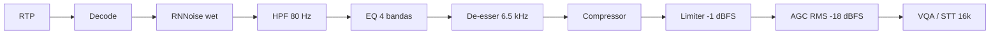

# Matriz DSP: recomendado (STT / atendimento) vs VoiceQAS

Comparativo entre uma cadeia DSP típica de inteligibilidade para STT/contact center e o VoiceQAS.

Defaults: [`include/voiceqas/audio/config.hpp`](../../include/voiceqas/audio/config.hpp), [`config/voiceqas.example.yaml`](../../config/voiceqas.example.yaml).  
Implementação: [`VoiceChannelStrip`](../../include/voiceqas/audio/dsp/channel_strip.hpp).  
Pipeline: [`audio-pipeline.md`](audio-pipeline.md).  
UI: Analysis Lab `#analysis` — mesa de knobs (`MixDesk`).

## Cadeia atual

AEC permanece responsabilidade do SBC upstream (fora do escopo do media plane).

## Matriz por estágio

| Estágio (recomendado) | Parâmetro / alvo | VoiceQAS hoje | Status |
|----------------------|------------------|---------------|--------|
| **AEC** | Ativo quando há playback no mesmo ambiente | Ausente (SBC upstream) | Fora do escopo |
| **Noise reduction** | 10–15 dB (nunca >20) | RNNoise + `wet_dry` (sem dose dB Speex) | Parcial |
| **High-pass** | 80 Hz, 12 dB/oct | HPF biquad 80 Hz, ON | Alinhado |
| **Low-pass** | 7–8 kHz | Só banda do codec | Ausente |
| **EQ 250 / 450 / 2.5k / 3.5k** | −3 / −2 / +2 / +2 | 4 peaking configuráveis | Alinhado |
| **De-esser** | 6.5 kHz, 3:1, thr −25 | Implementado + knobs | Alinhado |
| **Compressor** | 3:1, atk 5, rel 80, makeup +2 | Implementado + knobs | Alinhado |
| **Noise gate** | thr −45 dB | Ausente (`SttGate` = readiness VQA) | Ausente |
| **Limiter** | Ceiling −1 dBFS | Hard peak −1 dBFS (strip) | Alinhado |
| **AGC** | −18 LUFS | RMS **−18 dBFS** (proxy, não LUFS) | Parcial |
| **Sample rate STT** | 16 kHz | 16 kHz PCM16 | Alinhado |
| **Ordem** | NR → HPF → EQ → DeEss → Comp → Lim → AGC | Mesma ordem (sem AEC) | Alinhado |

## Lab / overrides

- YAML `audio.strip` + headers `X-Audio-AGC` / `X-Audio-Enhancement` / `X-Audio-Strip`
- Preview browser aproxima HPF/EQ/comp/lim/AGC; RNNoise só no servidor
- LEGACY_MIX no Lab: strip espectral OFF, AGC −20, NR off (baseline A/B)

## Scorecard

| Área | Cobertura | Nota |
|------|-----------|------|
| Formato STT | Completo | OK |
| Ruído (RNNoise + wet) | Parcial | Sem Speex dB |
| Nível (AGC/limiter) | Parcial | RMS ≠ LUFS |
| Espectral (HPF/EQ) | Completo | OK |
| Dinâmica (comp/de-ess) | Completo | Gate de amostras ainda ausente |
| AEC | Zero (SBC) | Integração |

**Veredito:** cadeia mínima anterior (AGC+RNNoise) foi expandida para channel strip configurável com defaults do plano e mesa no Analysis Lab.
