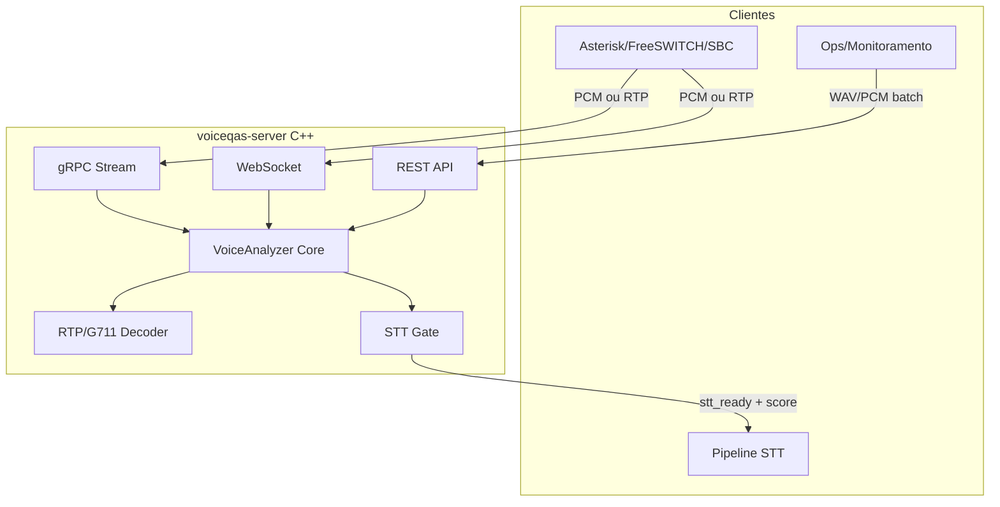
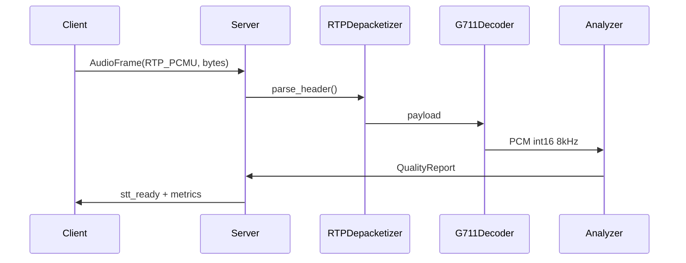

# Plano: voiceqas — Avaliação de Qualidade de Voz para STT

## Contexto

O diretório `[voiceqas](/home/caiovmv/workspace/voiceqas)` está vazio (greenfield). O objetivo é um serviço C++ **rápido** que avalia áudio de tronco SIP e responde se o trecho é **STT-ready** (apto para speech-to-text), com três interfaces de integração.

**Decisões confirmadas:**

- Ingestão **PCM decodificado** + **RTP/G.711 (PCMU/PCMA)** na mesma fase inicial
- **Streaming** (gate ao vivo) + **batch** (análise offline)

**Decisão técnica recomendada (sem PESQ/POLQA):** métricas objetivas leves otimizadas para telefonia. PESQ/POLQA são lentas, licenciadas e inadequadas para gate em tempo real (<50 ms por janela).

---

## Arquitetura




**Princípio:** um único motor `VoiceAnalyzer` compartilhado por todas as interfaces. Servidores são adaptadores finos.

---

## Métricas VQA (rápidas, orientadas a STT)

Calculadas por janela deslizante (padrão: **20 ms frame**, agregação **500 ms**):


| Métrica                         | Uso para STT                    | Alvo de latência |
| ------------------------------- | ------------------------------- | ---------------- |
| `rms_dbfs` / `peak_dbfs`        | Volume adequado                 | <0.1 ms/frame    |
| `clipping_ratio`                | Rejeitar áudio saturado         | <0.1 ms/frame    |
| `snr_estimate`                  | Relação fala/ruído (energy VAD) | <1 ms/janela     |
| `silence_ratio`                 | Detectar trechos sem fala       | <1 ms/janela     |
| `spectral_flatness`             | Ruído vs fala tonal             | <2 ms/janela     |
| `packet_loss_pct` / `jitter_ms` | Qualidade RTP                   | no decoder RTP   |
| `composite_score` (0–100)       | Score único                     | agregação        |
| `stt_ready` (bool)              | Gate binário com histerese      | regra de negócio |


**Regra STT-ready (configurável via env/config):**

- `composite_score >= threshold` (default 65)
- `silence_ratio <= max` (default 0.6)
- `clipping_ratio <= max` (default 0.02)
- `snr_estimate >= min_db` (default 12 dB)
- Histerese: 2 janelas consecutivas OK para `stt_ready=true`, 1 janela ruim para `false`

---

## Estrutura do projeto

```
voiceqas/
├── CMakeLists.txt
├── vcpkg.json
├── proto/voice_quality.proto
├── openapi/voiceqas.yaml
├── config/voiceqas.example.yaml
├── include/voiceqas/
│   ├── analyzer.hpp          # API do motor
│   ├── metrics.hpp           # structs de métricas
│   ├── stt_gate.hpp          # lógica de gate
│   ├── rtp/g711.hpp          # decode PCMU/PCMA
│   └── rtp/depacketizer.hpp  # RTP header parse
├── src/
│   ├── core/                 # analyzer, metrics, dsp (FFT leve)
│   ├── rtp/                  # g711, depacketizer
│   └── server/
│       ├── main.cpp
│       ├── grpc_service.cpp
│       ├── rest_server.cpp   # cpp-httplib
│       └── ws_server.cpp     # Boost.Beast
├── tests/                    # GoogleTest
├── docker/Dockerfile
└── README.md
```

---

## Contratos de API

### gRPC — `[proto/voice_quality.proto](voiceqas/proto/voice_quality.proto)`

```protobuf
service VoiceQualityService {
  rpc Ready(ReadyRequest) returns (ReadyResponse);
  rpc AnalyzeStream(stream AudioFrame) returns (stream QualityReport);
  rpc AnalyzeBatch(BatchRequest) returns (BatchResponse);
}

message AudioFrame {
  string session_id = 1;
  bytes payload = 2;           // PCM int16 LE ou RTP packet
  AudioFormat format = 3;      // PCM_S16LE_8K, PCM_S16LE_16K, RTP_PCMU, RTP_PCMA
  int64 timestamp_ms = 4;
}

message QualityReport {
  string session_id = 1;
  int64 window_start_ms = 2;
  double composite_score = 3;
  bool stt_ready = 4;
  Metrics metrics = 5;
}
```

- `AnalyzeStream`: **bidirectional streaming** — ideal para integração com pipeline STT via gRPC.

### REST — `[openapi/voiceqas.yaml](voiceqas/openapi/voiceqas.yaml)`


| Método | Endpoint              | Uso                                                                                                                     |
| ------ | --------------------- | ----------------------------------------------------------------------------------------------------------------------- |
| GET    | `/health`             | Liveness                                                                                                                |
| GET    | `/ready`              | Readiness                                                                                                               |
| POST   | `/v1/analyze/batch`   | Upload WAV ou PCM raw (`Content-Type: audio/wav` ou `application/octet-stream` + headers `X-Sample-Rate`, `X-Channels`) |
| POST   | `/v1/analyze/segment` | JSON com PCM base64 + metadados                                                                                         |


Resposta batch: score global, métricas agregadas, timeline de janelas, `stt_ready_segments[]`.

### WebSocket — `ws://host:port/v1/stream`

1. Cliente envia JSON de handshake: `{ "session_id", "format", "sample_rate" }`
2. Cliente envia frames binários (PCM ou RTP)
3. Servidor responde JSON `QualityReport` a cada janela de 500 ms

Ideal para dashboards e integrações que não usam gRPC.

---

## Stack C++ e dependências (vcpkg)


| Componente | Biblioteca                        | Motivo                            |
| ---------- | --------------------------------- | --------------------------------- |
| Build      | CMake 3.20+                       | Padrão C++                        |
| gRPC       | `grpc`, `protobuf`                | Streaming bidi, contrato forte    |
| REST       | `cpp-httplib`                     | Leve, sem bloquear o core         |
| WebSocket  | `boost-beast`                     | WS + HTTP no mesmo processo       |
| JSON       | `nlohmann-json`                   | WS/REST responses                 |
| Config     | `yaml-cpp`                        | Thresholds configuráveis          |
| Testes     | `gtest`                           | Unit tests do core                |
| DSP        | código próprio + opcional `pffft` | FFT rápida para spectral flatness |


**Não incluir na fase inicial:** PJSIP (stack SIP completa), PESQ, Whisper — voiceqas é **gate de qualidade**, não STT.

---

## Fluxo de ingestão RTP/G.711




- Suporte inicial: **PCMU (payload type 0)** e **PCMA (payload type 8)**
- Métricas RTP: sequence gap → packet loss; timestamp delta → jitter
- PCM 16 kHz: aceitar direto; se 8 kHz, opcional upsample simples (fase 2, não bloqueante)

---

## Ordem de implementação

### Fase 1 — Core + REST batch (base testável)

- Scaffold CMake + vcpkg + estrutura de diretórios
- `VoiceAnalyzer`: RMS, clipping, VAD energético, SNR, silence ratio
- `SttGate`: score composto + histerese
- REST: `/health`, `/ready`, `/v1/analyze/batch`
- Testes unitários com samples sintéticos (silêncio, ruído, clipping, fala simulada)

### Fase 2 — RTP/G.711 + streaming core

- `G711Decoder` + `RtpDepacketizer`
- Janela deslizante stateful por `session_id`
- Métricas RTP (loss, jitter)

### Fase 3 — gRPC streaming

- `voice_quality.proto` + codegen
- `AnalyzeStream` bidi
- `AnalyzeBatch` unary (reutiliza core)

### Fase 4 — WebSocket streaming

- Handshake JSON + frames binários
- Mesmo `session_id` semantics do gRPC

### Fase 5 — Operação

- `config/voiceqas.example.yaml` (thresholds, portas, janelas)
- Dockerfile multi-stage
- README com exemplos `grpcurl`, `curl`, cliente WS

### Fase 6 — Audio pipeline + media relay (branch `feature/audio-pipeline-media-relay`)

**Concluído:**

- `audio::decode_to_pcm` / `encode_from_pcm` unificados
- AGC inbound (`AudioNormalizer`) configurável via YAML
- Encode G.711 C++ + `RtpPacketizer`
- G.722/G.729 stateful por sessão
- `MediaSessionManager` (format lock, egress agente)
- `MediaRelayServer` UDP `:10000`
- REST: `/v1/media/sessions`, `.../agent-audio`
- `pack-rtp` estendido para G.711

**Pendente:**

- Silero VAD C++ no STT (sherpa-onnx)
- `proto/media.proto` + gRPC media
- Enhancement neural (RNNoise) condicional
- Tester-web: painel media relay

Spec: [`docs/spec/audio-pipeline.md`](audio-pipeline.md). Memória de agente: [`AGENTS.md`](../../AGENTS.md).

---

## Configuração e portas (defaults)

```yaml
server:
  rest_addr: "0.0.0.0:8080"
  grpc_addr: "0.0.0.0:50051"
  ws_addr: "0.0.0.0:8081"
  media_rtp_addr: "0.0.0.0:10000"
analyzer:
  frame_ms: 20
  window_ms: 500
  stt_ready_threshold: 65
  min_snr_db: 12
  max_clipping_ratio: 0.02
  max_silence_ratio: 0.60
audio:
  normalize_enabled: true
  agc_target_rms_dbfs: -20
media:
  enabled: true
```

Variáveis de ambiente sobrescrevem YAML (padrão 12-factor).

---

## Critérios de aceitação

1. **Latência streaming:** <50 ms entre recebimento de frame e emissão de `QualityReport` (janela completa), medido em benchmark local com PCM 8 kHz
2. **Batch:** analisar WAV de 30 s em <500 ms (CPU moderna, single thread)
3. **RTP:** decodificar PCMU/PCMA corretamente (teste com pacotes RFC 3551 conhecidos)
4. **STT gate:** áudio com clipping >5% → `stt_ready=false`; fala limpa simulada → `stt_ready=true`
5. **APIs:** as três interfaces retornam o mesmo `QualityReport` para o mesmo input PCM
6. **Observabilidade:** logs estruturados por `session_id`; métricas expostas em `/ready`

---

## Riscos e mitigações


| Risco                                          | Mitigação                                                                      |
| ---------------------------------------------- | ------------------------------------------------------------------------------ |
| G.729/outros codecs no tronco                  | Documentar suporte inicial só G.711; extensão via interface `CodecDecoder`     |
| Falso positivo no gate                         | Thresholds configuráveis + histerese; calibração com gravações reais do tronco |
| Complexidade de 3 servidores no mesmo processo | Thread pool compartilhado; core lock-free por sessão                           |
| 8 kHz vs 16 kHz STT                            | Aceitar ambos; documentar que STT downstream deve alinhar sample rate          |


---

## Referência arquitetural no workspace

O projeto `[penny-ai](/home/caiovmv/workspace/penny-ai)` tem padrões reutilizáveis de contrato gRPC (`[contracts/penny_platform.proto](/home/caiovmv/workspace/penny-ai/contracts/penny_platform.proto)`) e endpoints `/health` + `/ready`, mas **não** será dependência — apenas referência de estilo.

---

## Spec pós-implementação

Após conclusão, criar `[voiceqas/docs/spec/voice-quality-assessment.md](voiceqas/docs/spec/voice-quality-assessment.md)` com métricas, thresholds, contratos API e critérios STT-ready observáveis.